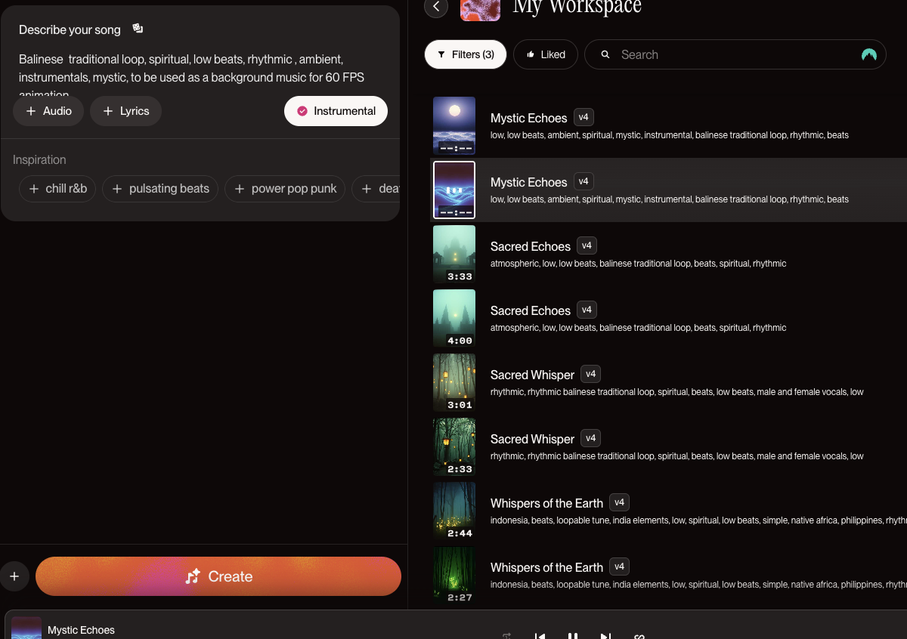

# Functioning Prototype – “Seeing the Void”

## Overview
My individual prototype draws on Pacita Abad’s Wheels of Fortune (2000) by focusing on the eye motif from group work, symbolic of observation and introspection, within a swirling wheel of textures and shapes. In Abad’s original work, concentric circles of trapunto, beading, and collage evoke the cycles of fate, migration, and cultural exchange. My idea is to introduce noise to create movement to one of the motifs from group work to represent theme of witnessing the world’s interconnected stories through a diverse tapestry of forms and hues.


## 1.Interaction Instructions
- Load the page and allow a few seconds for the animation to initialise.
- Press any key (e.g. spacebar) to start or pause the background music.
- Resize your browser window the entire artwork will scale fluidly to fit.
- Over time (at default 60 FPS), Perlin noise drives subtle changes in shape size, position, and background pattern, bringing the composition to life.

## 2.Individual Approach
I chose Perlin noise (not time or direct user interaction) to modulate the size of the seven concentric pupil circles and to introduce jitter into our background rings. This approach preserves the hypnotic, organic movement found in Olaf Keller’s “Hypnotic Circles” sketch (Keller, n.d.) while ensuring non-repetitive, smooth transitions.

### Properties animated
- Pupil circles resize continuously around a central point, each with a unique noise-speed factor (factors[]) so that inner and outer rings pulse asynchronously.
- Background pattern consists of 20 concentric rings of shapes (ellipses, squares, triangles). Each shape’s position and size receive small Perlin-driven offsets, creating a dynamic, textural field beneath the eye.
- Music loads independently: a looping AI-generated soundtrack (Suno AI, 2024) complements the visual movement and can be toggled on/off via any keypress.

### Distinctiveness from group
 While other students might animate color shifts or component visibility, our prototype uniquely animates geometric form and spatial jitter via Perlin noise, and integrates background music triggered by user input—enhancing both the visual and auditory immersion.

## 3.Inspirational References
### Hypnotic Circles
 Olaf Keller’s generative sketch inspired our noise-driven pupil animation (Keller, n.d.).

### p5.Sound Tutorial
 Daniel Shiffman’s “Intro to p5.Sound” guided our implementation of looping audio and key-triggered playback (The Coding Train, 2017).

### bezierVertex()
 We replicated the group’s eye-shape logic using p5.js’s Bezier curves (p5.js, n.d.).

## 4.Technical Explanation
### 4.1 Preload
```
bgMusic = loadSound('libraries/background.mp3')
```
loads an AI-generated MP3 for looping.

### 4.2 Setup
```
createCanvas(windowWidth, windowHeight)
```
establishes a responsive canvas.

Seven instances of pupilCircle are created—each with its own noise offset, size percentage (sizePercents), speed factor (factors), and fill color (pupilPalette).

### 4.3 Draw
#### Eye shape: 
A white, thick-stroked Bezier outline (50% of canvas height) is rendered at center, mirroring the group’s logic (p5.js, n.d.).


#### Pupils: 
Each pupilCircle.display() call reads noise(this.noiseOffset) to compute a diameter up to its assigned percentage of height, then advances noiseOffset by this.factor for smooth pulsation.


#### Background pattern
Twenty concentric rings are drawn around the canvas center. Each ring’s radius shifts by radialOffset = frameCount %, and each shape within the ring (ellipse, rectangle, triangle) is perturbed by Perlin noise (noise(layer, i)), producing a constantly evolving textural field.
Add background sound and user input according to browser restrictions.


### 4.4 Interaction & Responsiveness
- keyPressed() toggles audio playback, satisfying browsers’ user-gesture requirements (Shiffman, 2017).
- windowResized() recalculates canvas dimensions, ensuring all elements—eye, background, pupils—scale in unison.


## 5.Modifications from Group Code
- Added Perlin-noised resizing of pupil circles (inspired by Keller’s sketch).
- Extended the background ring logic to include three shape types and noisy perturbations.
- Integrated AI-generated music (Suno AI, 2024) with keypress control.
- Refactored eye-shape drawing to a standalone section, improving clarity.
- Encapsulated pupil animation in a pupilCircle class for reusability and parameter control.

## 6.External Tools & Techniques
- p5.Sound library (Shiffman, 2017) for audio loading, looping, and user-gesture compliance.
- Suno AI (2024) to generate a culturally textured soundtrack blending Indonesian gamelan, African percussion, and Philippine kulintang, chosen for its seamless 60 FPS compatibility.

- OpenProcessing examples (Keller, n.d.) to inform our noise-driven aesthetic.

## References
- Abad, P. (2000). Wheels of Fortune [Mixed-media collage on mylar and fabric]. Private collection.
- Keller, O. (n.d.). Hypnotic Circles [Sketch]. OpenProcessing. https://openprocessing.org/sketch/134155
- p5.js. (n.d.). bezierVertex() [p5.js reference]. https://p5js.org/reference/#/p5/bezierVertex
- Shiffman, D. (2017, May 4). Intro to p5.Sound [Video]. The Coding Train. https://www.youtube.com/watch?v=6O6g4xZqfUo
- Shiffman, D. (2016, May 18). Coding Challenge #55: 2D Perlin Noise [Video]. The Coding Train. https://youtu.be/86p3WMWM5_o
- Suno AI. (2024). Suno: AI-generated music. https://www.suno.ai
